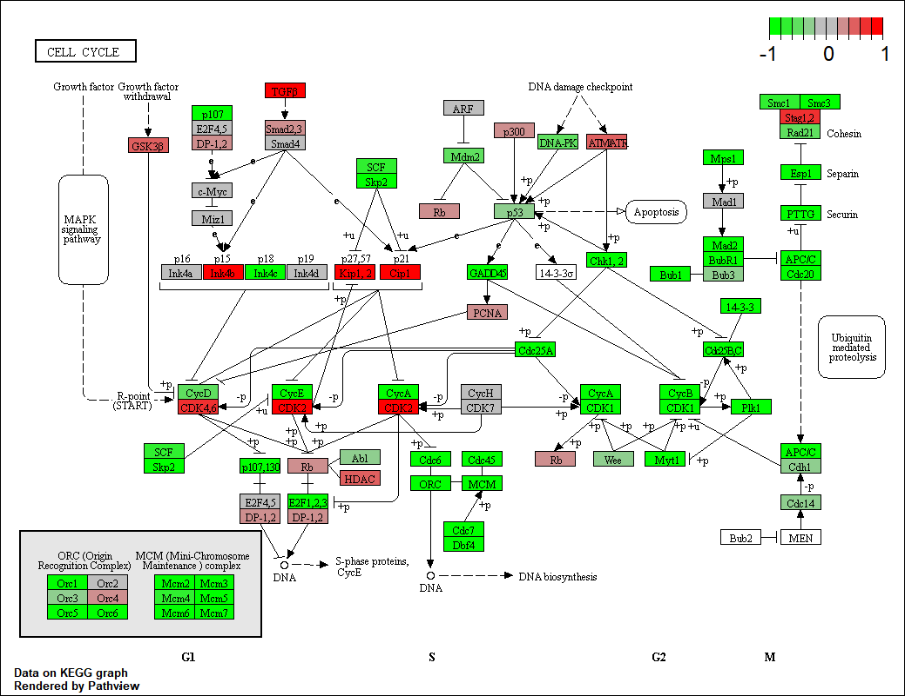
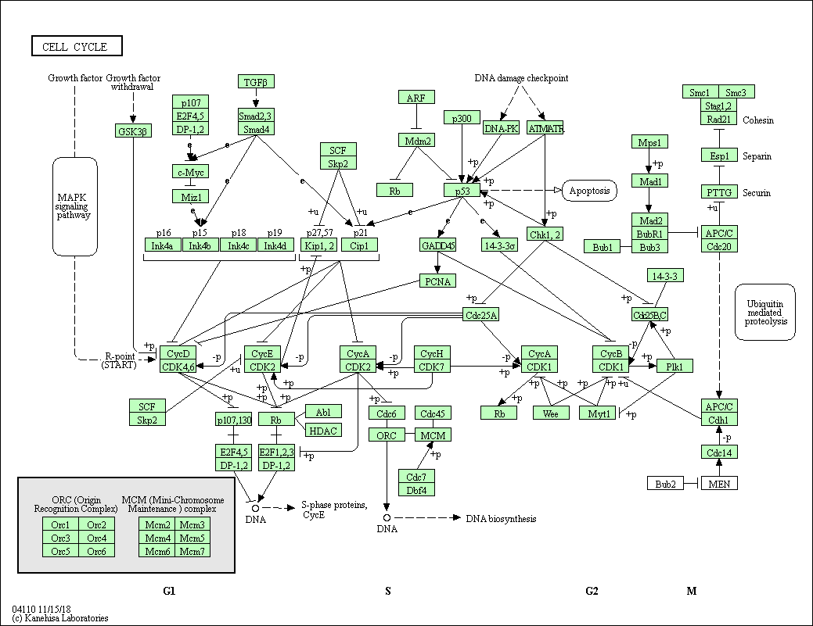

```{r setup, include=FALSE}
knitr::opts_chunk$set(echo = TRUE)
```

## R Markdown

This is an R Markdown document. Markdown is a simple formatting syntax for authoring HTML, PDF, and MS Word documents. For more details on using R Markdown see <http://rmarkdown.rstudio.com>.

When you click the **Knit** button a document will be generated that includes both content as well as the output of any embedded R code chunks within the document. You can embed an R code chunk like this:

https://bioboot.github.io/bimm143_W19/class-material/lecture16_BIMM143_F18.html
  link of project
  
```{r deseq_load, message=FALSE}
library(DESeq2)
```
```{r}
metaFile <- "data/GSE37704_metadata.csv"
countFile <- "data/GSE37704_featurecounts.csv"

```

Read the metadata file first with first row omitted
```{r}
colData = read.csv(metaFile, row.names = 1)
head(colData)
countData = read.csv(countFile, row.names = 1)
head(countData)

```

remove length col, and we need the right order
  need rows match exactly columns 
  rid of first colhmn
```{r}
countData <- as.matrix(countData[,-1]) # only once
head(countData)
dim(countData)

```
#why is there 0s 
```{r}
rownames(colData)
colnames(countData)
all ( rownames(colData) == colnames( countData)) #return vector compare all
```
Q. Complete the code below to filter countData to exclude genes (i.e. rows) where we have 0 read count across all samples (i.e. columns).remove first column
Nice now lets setup the DESeqDataSet object required for the DESeq() function and then run the DESeq pipeline. This is again similar to our last days hands-on session.

```{r}
head(countData)
# countData = countData[__, ]
countData = countData[rowSums(countData)!=0,]
head(countData)
```
how many genes do we have left?
```{r}
nrow(countData)
```


15975 
##Running Deseq2
# go to condition
```{r}

dds = DESeqDataSetFromMatrix(countData = countData, 
                             colData = colData,
                             design = ~condition)
dds = DESeq(dds)

```
now results of HoxA1 knockdown vees control siRNA
```{r}
res = results(dds, contrast=c("condition", "hoxa1_kd", "control_sirna"))
summary((res))

```
plot volcano
```{r}
plot( res$log2FoldChange, -log(res$padj))
#smaller the better _
head(res)
```

```{r}
mycols <- rep("gray", nrow(res)) #rep : replicate , 6 vector of rows 
mycols[ abs(res$log2FoldChange) > 2] <- "red"

#use blue cols if fold change > 2 and P < .01
inds <- abs(res$log2FoldChange) >2 & res$padj <.01 # dont really need parenthesis
mycols[inds] <- "blue"
plot(res$log2FoldChange, -log(res$padj), col = mycols)
```

#Adding gene annotation

```{r eval= FALSE}
source("http://bioconductor.org/biocLite.R")
biocLite("AnnotationDbi")
biocLite("org.Hs.eg.db")

```

```{r}
library("AnnotationDbi")
library("org.Hs.eg.db")
columns(org.Hs.eg.db)
```
```{r}
res$symbol = mapIds(org.Hs.eg.db,
                    keys=row.names(res), 
                    keytype="ENSEMBL",
                    column="SYMBOL",
                    multiVals="first")
res$entrez = mapIds(org.Hs.eg.db,
                    keys=row.names(res),
                    keytype="ENSEMBL",
                    column="ENTREZID",
                    multiVals="first")

res$name =   mapIds(org.Hs.eg.db,
                    keys=row.names(res),
                    keytype="ENSEMBL",
                    column="GENENAME",
                    multiVals="first")

head(res, 10)# ck select()!
```

Q finally reorder these results
```{r}
res = res[order(res$pvalue),] #results taken by first and mapped to diff database and automated function finding in later sections 
write.csv( res , file = "deseq_results.csv")
head(read.csv("deseq_results.csv")) # read results 
```
#mapped genes to databases and now need see packages that automate finding genes functions 
#now install packages for pathway viewing
```{r eval=FALSE}
source("http://bioconductor.org/biocLite.R")
biocLite( c("pathview", "gage", "gageData") )

```
```{r}
library (pathview)
```
```{r}

library (gage)
library(gageData)
data(kegg.sets.hs)
data(sigmet.idx.hs)

# Focus on signaling and metabolic pathways only
kegg.sets.hs = kegg.sets.hs[sigmet.idx.hs]

# Examine the first 3 pathways
head(kegg.sets.hs, 3)

```
The main gage() function requires a named vector of fold changes, where the names of the values are the Entrez gene IDs.

Note that we used the mapIDs() function above to obtain Entrez gene IDs (stored in  res$entrez) and we have the fold change results from DESeq2 analysis (stored in  res$log2FoldChange).
```{r}
foldchanges = res$log2FoldChange
names(foldchanges) = res$entrez
head(foldchanges)
```

```{r}
#get results
keggres = gage(foldchanges, gsets=kegg.sets.hs)
attributes(keggres)
```
##
```{r}
head(keggres$less)
```
```{r}
pathview (gene.data = foldchanges, pathway.id = "hsa04110")
```


```{r}
# A different PDF based output of the same data
temp <- (pathview(gene.data=foldchanges, pathway.id="hsa04110", kegg.native=FALSE)) ## need to know how to print! this graph
temp
```


